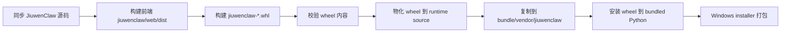

# JiuwenClaw Wheel-to-Vendor Packaging Design

本文设计 JiuwenClaw 在 Windows 安装包中的新打包链路：先从源码仓拉取 JiuwenClaw，构建成 runtime-complete wheel，再从 wheel 物化出可运行的 Python runtime source，最后随 OfficeClaw Windows 安装包分发。

核心约束：**不改变 OfficeClaw 拉起 JiuwenClaw 的方式**。wheel 只作为打包流程中的 artifact boundary，安装包内仍然落到 `bundle/vendor/jiuwenclaw`，运行时仍按现有 Python/source 方式启动 `jiuwenclaw.app_agentserver`；不在本路线中放置 `vendor/jiuwenclaw.exe`。

## 背景

当前 Windows 打包入口在根 `package.json` 中：

```text
pnpm package:windows
-> pnpm vendor:sync:jiuwenclaw
-> node ./scripts/build-windows-installer.mjs
```

其中 `vendor:sync:jiuwenclaw` 读取 `packaging/windows/jiuwenclaw-source.json`，从 JiuwenClaw 仓库同步源码到 `vendor/jiuwenclaw`。现有 `scripts/build-windows-installer.mjs` 直接复制这个源码目录到安装包 bundle，并把 `vendor/jiuwenclaw` 加入 bundled Python 的 `.pth`，运行时再通过 Python/source 入口启动 JiuwenClaw。

新流程不改变最终运行形态，只把打包阶段的 artifact boundary 从 Git source 改成 wheel。

## 目标流程



设计上不把 wheel 当作“可逆还原 Git 源码”的容器，而是把它定义为一个 runtime-complete Python artifact。从 wheel 得到的 source tree 只需要满足运行时 import 和资源读取，不需要恢复 `.git`、测试目录、开发脚本全量上下文或原始前端源码。

## 非目标

- 不修改 OfficeClaw 运行时拉起 JiuwenClaw 的逻辑。
- 不把 JiuwenClaw 切换成 exe 启动。
- 不从 wheel 反向恢复完整 Git source tree。
- 不修改 JiuwenClaw 运行时配置、用户数据目录或安装器保留策略。
- 不把依赖解析混进 wheel 物化逻辑；依赖仍由 bundled Python / wheelhouse / pip 安装阶段解决。

## 新增构建层级

### Stage 1: Build Wheel

脚本：

```text
scripts/build-jiuwenclaw-wheel.mjs
```

职责：

1. 检查 `vendor/jiuwenclaw/pyproject.toml` 是否存在。
2. 检查 Python 版本满足 `>=3.11,<3.14`。
3. 进入 `vendor/jiuwenclaw/jiuwenclaw/web`，执行 `npm install` 和 `npm run build`。
4. 执行 `python -m pip wheel --no-deps --wheel-dir <output> vendor/jiuwenclaw`。
5. 找到最新的 `jiuwenclaw-*.whl`。
6. 以 zip 方式检查 wheel 内容，不满足 runtime-complete 条件则失败。
7. 输出 manifest，记录 wheel 路径、源 commit、构建时间和关键文件校验结果。

命令：

```text
pnpm jiuwenclaw:wheel
pnpm jiuwenclaw:wheel:sync
```

输出：

```text
dist/jiuwenclaw-wheel/
  jiuwenclaw-0.1.10-py3-none-any.whl
  jiuwenclaw-wheel-manifest.json
```

### Stage 2: Materialize Wheel Source

脚本：

```text
scripts/materialize-jiuwenclaw-wheel-source.mjs
```

职责：

1. 输入一个 `jiuwenclaw-*.whl`。
2. 只提取运行所需内容：

```text
dist/jiuwenclaw-wheel-source/
  jiuwenclaw/
    *.py
    resources/
    web/dist/
  metadata/
    jiuwenclaw-*.dist-info/
```

3. 拒绝路径穿越和非预期 wheel entry。
4. 校验 `jiuwenclaw/`、`resources`、`web/dist`、dist-info metadata 是否存在。
5. 输出 `jiuwenclaw-wheel-source-manifest.json`。

命令：

```text
pnpm jiuwenclaw:wheel:source
```

### Stage 3: Windows Installer Wheel Vendor Mode

脚本：

```text
scripts/build-windows-installer.mjs --jiuwenclaw-vendor-source wheel
```

职责：

1. 解析 `--jiuwenclaw-wheel <path>`；未传时使用 `dist/jiuwenclaw-wheel` 下最新 wheel。
2. 调用 Stage 2 物化 runtime source。
3. 将 `jiuwenclaw/` 复制到 `bundle/vendor/jiuwenclaw`。
4. 将 manifest 复制到 `bundle/vendor/jiuwenclaw-wheel-source-manifest.json`，便于追踪来源。
5. bundled Python 安装 JiuwenClaw 时使用 wheel 文件，而不是原始源码目录。
6. 后续仍走现有 bundle、compile pyc、runtime package、installer 流程。

命令：

```text
pnpm package:windows:bundle:jiuwen-wheel
pnpm package:windows:jiuwen-wheel
```

默认命令保持不变：

```text
pnpm package:windows
pnpm package:windows:bundle
```

## Wheel 内容校验

Stage 1 至少检查：

```text
jiuwenclaw/app.py
jiuwenclaw/app_web.py
jiuwenclaw/desktop_app.py
jiuwenclaw/resources/config.yaml
jiuwenclaw/resources/.env.template
jiuwenclaw/web/dist/index.html
*.dist-info/METADATA
*.dist-info/RECORD
```

同时检查不应出现：

```text
jiuwenclaw/web/node_modules/
```

如果 wheel 缺 `web/dist`，脚本应明确报错，避免产出一个能安装但运行时缺 UI 的半成品。

## 依赖策略

JiuwenClaw 自身 wheel 使用 `pip wheel --no-deps` 构建，只表达 JiuwenClaw 代码和资源。Windows installer 阶段仍先安装 JiuwenClaw project dependencies，再安装 JiuwenClaw wheel 本体：

```text
python -m pip install <jiuwen project deps>
python -m pip install --no-deps <jiuwenclaw.whl>
```

这样保持现有 bundled Python 模型不变，同时把 JiuwenClaw 自身代码来源切换成 wheel。

## 风险与对策

### R1: Wheel 缺前端资源

风险：如果构建 wheel 前没有执行前端 build，wheel 可能缺少 `jiuwenclaw/web/dist/index.html`。

对策：`build-jiuwenclaw-wheel.mjs` 先构建前端，并在 wheel zip 内强制检查 `jiuwenclaw/web/dist/index.html`。

### R2: Wheel 不是完整 Git 源码

风险：wheel 物化出来的目录不包含 tests、docs、开发脚本、`.git` 等内容。

对策：这是预期行为。安装包运行时只依赖 Python package、resources、web/dist 和 bundled Python 依赖，不应依赖 Git 源码上下文。

### R3: Python path 与安装包原路径要保持一致

风险：OfficeClaw 运行时仍按 `vendor/jiuwenclaw` 解析 JiuwenClaw。如果 wheel 物化目录落点变化，会破坏现有启动路径。

对策：installer wheel 模式固定把物化出的 `jiuwenclaw/` 复制到 `bundle/vendor/jiuwenclaw`，不改变 `jiuwenclaw-paths.ts` 和 sidecar 启动逻辑。

### R4: 依赖来源不稳定

风险：在线 pip / Git 依赖会让打包机受网络影响。

对策：短期沿用现有 installer 依赖安装策略；后续如需稳定离线构建，应在 wheelhouse 层解决，而不是把依赖塞进 JiuwenClaw 自身 wheel。

## 最小验收

第一阶段验收：

```text
pnpm jiuwenclaw:wheel:sync
pnpm jiuwenclaw:wheel:source -- --wheel <wheel>
```

第二阶段验收：

```text
pnpm package:windows:bundle:jiuwen-wheel
```

检查 bundle：

```text
dist/windows/bundle/vendor/jiuwenclaw/jiuwenclaw/app.py
dist/windows/bundle/vendor/jiuwenclaw/jiuwenclaw/resources/config.yaml
dist/windows/bundle/vendor/jiuwenclaw/jiuwenclaw/web/dist/index.html
dist/windows/bundle/vendor/jiuwenclaw-wheel-source-manifest.json
```

这条路线完成后，OfficeClaw 运行时仍按原方式拉起 JiuwenClaw，只是安装包中 JiuwenClaw runtime source 的来源变成了 wheel。
