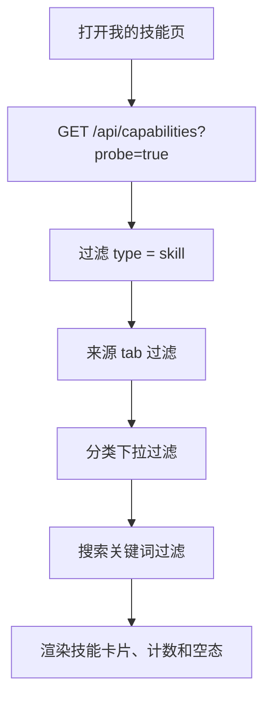
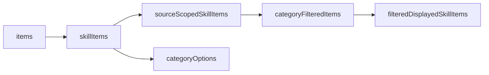
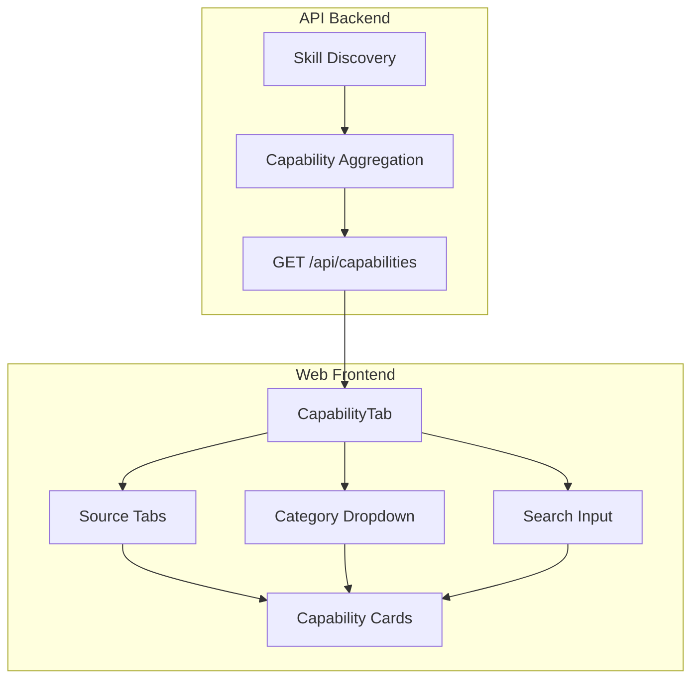
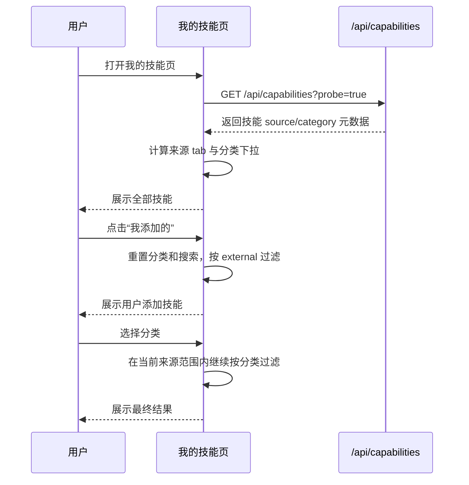
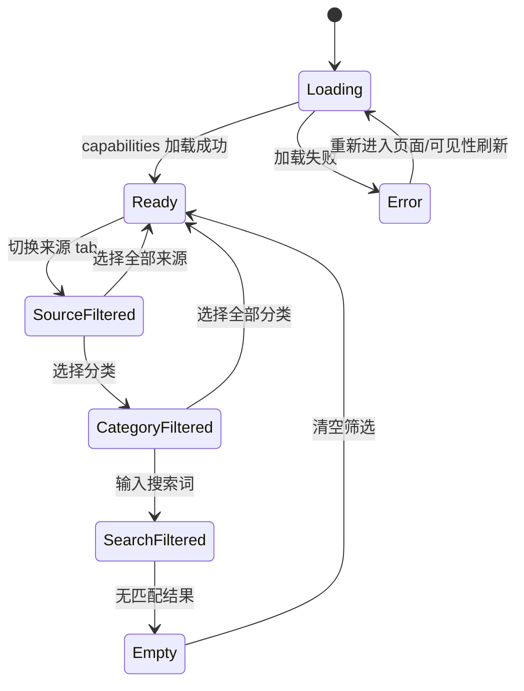

# 我的技能来源与分类筛选调整设计

## 背景

当前“我的技能”页用于管理已安装技能，技能数据来自后端统一能力看板接口 `/api/capabilities`。历史交互中，顶部 tab 更偏向“技能分类”，来源筛选则通过下拉框完成。实际使用时，用户更常先区分“平台精选”和“我添加的”，再在某个来源范围内按业务分类筛选，因此本设计将两类筛选的视觉位置和语义重点调换。

调整后的交互：

1. 顶部 tab：`全部`、`我添加的`、`平台精选`。
2. 下拉框：承载技能分类，包含 `全部` 和当前已知分类。
3. 过滤顺序：来源 tab -> 分类下拉 -> 搜索关键词。
4. 不调整后端接口契约，不改变技能安装、卸载、更新和运行时发现逻辑。

## 1. 需求分析

### 1.1 需求场景分析

用户在“我的技能”页主要有三类任务：

1. 查看自己可用的全部技能。
2. 区分平台预置技能和自己添加的技能，避免误删或误判技能来源。
3. 在技能数量较多时，继续按分类或关键词缩小范围。

新的筛选关系需要满足：

1. `全部` tab 展示全部已安装技能。
2. `我添加的` tab 展示用户添加、导入或远端安装后落到用户技能目录的技能。
3. `平台精选` tab 展示应用预置技能。
4. 分类下拉保留完整分类集合，不因为切换来源 tab 而丢失分类选项。
5. 切换来源或分类时清空搜索，避免旧搜索条件造成“看起来没有数据”的误解。

### 1.2 架构影响分析

本需求属于前端展示和筛选语义调整，后端仍按统一能力模型返回技能列表。

影响范围：

1. 前端 `CapabilityTab`：维护来源 tab 状态、分类下拉状态、搜索状态和组合过滤。
2. 前端 `capability-board-ui`：继续消费 `CapabilityBoardItem.source/category`，无需新增字段。
3. 后端 `/api/capabilities`：继续返回 `items[].source` 与 `items[].category`，接口不变。
4. 测试：补充来源 tab、分类下拉、组合过滤、空态和计数展示相关用例。

不影响范围：

1. 技能安装、卸载、更新接口。
2. 技能目录扫描与 provider 挂载。
3. 聊天输入框技能选择缓存。
4. SkillHub 广场分类浏览逻辑。

### 1.3 版本兼容性

接口保持兼容：

1. 继续使用已有 `CapabilityBoardItem.source` 字段，取值为 `builtin` 或 `external`。
2. 继续使用已有 `CapabilityBoardItem.category` 字段；缺失时前端归入 `其他`。
3. 不要求后端新增字段，不要求持久化数据迁移。

老数据兼容：

1. 已安装技能如果没有分类，仍可显示在 `其他` 分类。
2. 只要后端能识别为用户技能目录或外部安装记录，即展示在 `我添加的`。
3. 预置技能仍依赖后端能力发现结果标记为 `builtin`，展示在 `平台精选`。

## 2. 方案设计

### 2.1 整体方案设计

前端从 `/api/capabilities?probe=true` 获取统一能力数据后，在页面本地完成三层过滤。



### 2.2 详细方案设计

#### 来源 tab

来源 tab 使用固定顺序：

1. `全部`：不过滤 `source`。
2. `我添加的`：仅展示 `source === external`。
3. `平台精选`：仅展示 `source === builtin`。

tab 切换行为：

1. 更新 `activeSkillSource`。
2. 重置 `activeCategory` 为 `全部`。
3. 清空 `searchQuery`。
4. 关闭分类下拉浮层。

#### 分类下拉

分类下拉从全部技能的 `category` 字段中计算，而不是从当前来源 tab 中计算。这样即使当前来源下没有某个分类，用户仍能看到完整分类体系，符合“下拉框有的东西都补齐”的要求。

分类规则：

1. 第一项固定为 `全部`。
2. 有分类的技能使用 `item.category.trim()`。
3. 无分类或空分类归入 `其他`。
4. `办公套件` 等重点分类可按优先级靠前。
5. `其他` 排在末尾。

#### 搜索

搜索在来源和分类过滤后执行，搜索字段包括：

1. 技能 id。
2. 技能描述。
3. 技能分类。

### 2.3 接口设计

本需求不新增接口，沿用能力看板接口。

```http
GET /api/capabilities?probe=true
```

关键响应字段：

```ts
interface CapabilityBoardResponse {
  items: CapabilityBoardItem[];
  catFamilies: CatFamily[];
  projectPath: string;
}

interface CapabilityBoardItem {
  id: string;
  type: 'mcp' | 'skill';
  source: 'builtin' | 'external';
  category?: string;
  description?: string;
  enabled: boolean;
  cats: Record<string, boolean>;
}
```

### 2.4 数据结构设计

前端新增或明确的 UI 状态：

```ts
const ALL_SKILL_SOURCES = 'all';

type SkillSourceScope = CapabilityBoardItem['source'] | typeof ALL_SKILL_SOURCES;

const SKILL_SCOPE_TABS = [
  { id: 'all', label: '全部' },
  { id: 'external', label: '我添加的' },
  { id: 'builtin', label: '平台精选' },
];
```

派生数据结构：



### 2.5 架构图



### 2.6 时序图



### 2.7 状态图



## 3. 可靠可用性

1. 加载失败时展示错误信息，不影响用户切换到其他 Hub 页面。
2. 分类下拉由当前完整技能集合计算，减少切换来源后分类突然消失导致的困惑。
3. 当当前选中分类不再存在时，自动回退到 `全部`。
4. 来源、分类、搜索均为前端派生状态，不写入持久化配置，避免状态污染。
5. 空结果使用统一空态，区分“没有技能”和“筛选无结果”。
6. `visibilitychange` 回到页面可刷新能力数据，避免技能安装、卸载、更新后列表长期陈旧。

## 4. 安全隐私

1. 本需求不新增网络请求来源，不扩大后端接口权限。
2. 本需求不读取技能文件内容以外的新数据，不上传本地技能详情。
3. 来源分类仅使用后端已返回的 `source/category` 元数据，不暴露本地绝对路径。
4. 筛选状态仅存在前端内存中，不持久化用户行为。
5. 用户添加技能和平台精选技能的操作边界保持不变：卸载仍只对可卸载的外部技能开放，平台预置技能不会因为筛选调整获得删除入口。

## 验收标准

1. 顶部 tab 从左到右为 `全部`、`我添加的`、`平台精选`。
2. 下拉框展示 `全部` 和全部已知技能分类。
3. `我添加的` 只展示外部/用户添加技能。
4. `平台精选` 只展示预置技能。
5. 分类下拉可在任意来源 tab 下继续过滤。
6. 搜索在当前来源和分类范围内生效。
7. 切换来源 tab 会清空分类和搜索条件。
8. 缺失分类的技能归入 `其他`，且不影响页面渲染。
